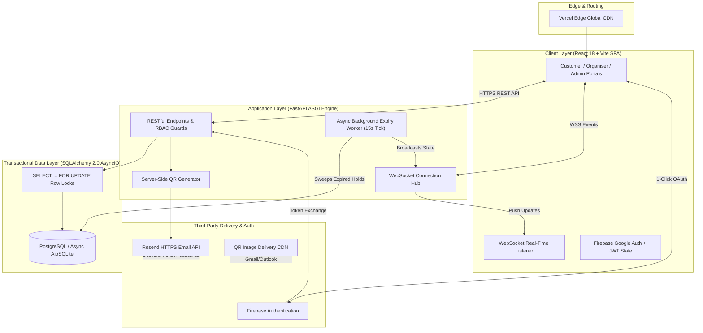
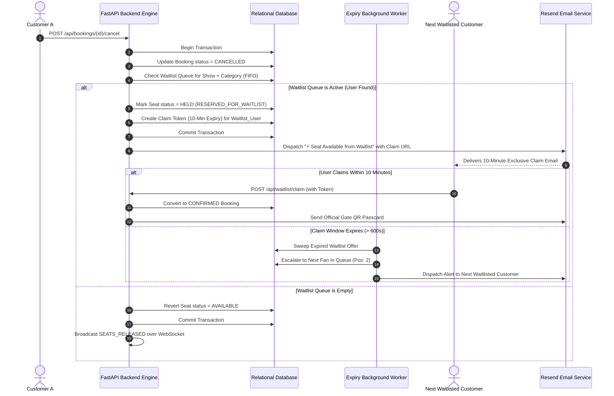
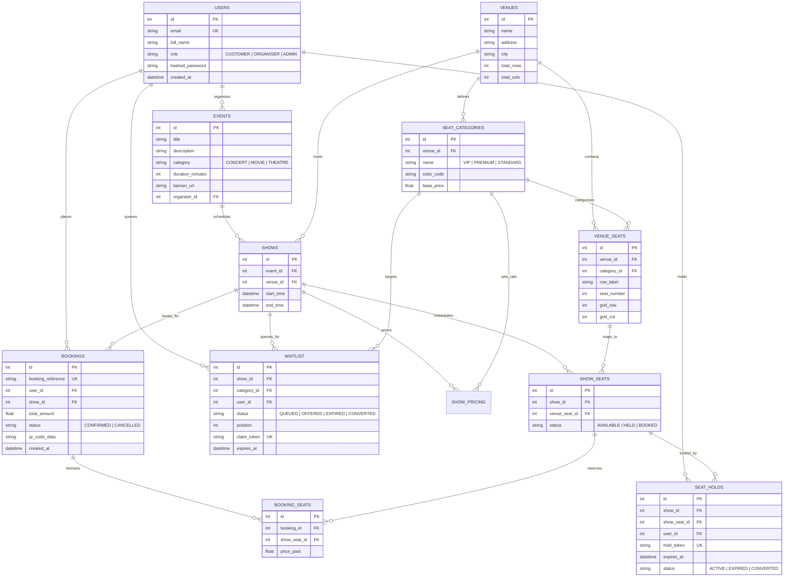

<div align="center">

# 🎟️ LUMINA
### Enterprise-Grade, High-Concurrency Live Experience & Ticketing Engine

[](https://lumina-woad-eta.vercel.app)
[](https://lumina-16hr.onrender.com/docs)
[](https://www.python.org/)
[](https://fastapi.tiangolo.com/)
[](https://reactjs.org/)
[](LICENSE)

<p align="center">
  <b>Deterministic Concurrency Control</b> • <b>10-Minute TTL Seat Holds</b> • <b>Real-Time WebSockets</b> • <b>FIFO Waitlist Reallocation</b> • <b>Server-Side Gate QR Delivery</b>
</p>

---

</div>

## 📌 Table of Contents
- [Why LUMINA Exists](#-why-lumina-exists)
- [System Architecture](#-system-architecture)
- [Key Features](#-key-features)
- [Deep Dive: Concurrency & Atomicity Engine](#-deep-dive-concurrency--atomicity-engine)
- [FIFO Waitlist & Cancellation Reallocation Flow](#-fifo-waitlist--cancellation-reallocation-flow)
- [Role-Based Access Control (RBAC)](#-role-based-access-control-rbac)
- [Database Schema (ERD)](#-database-schema-erd)
- [Tech Stack](#-tech-stack)
- [Getting Started](#-getting-started)
  - [Prerequisites](#prerequisites)
  - [Backend Setup](#1-backend-setup)
  - [Frontend Setup](#2-frontend-setup)
  - [Environment Variables](#environment-variables-reference)
- [Automated Testing Suite](#-automated-testing-suite)
- [API Reference](#-api-reference)
- [Deployment Topology](#-deployment-topology)
- [Repository Structure](#-repository-structure)
- [Roadmap](#-roadmap)
- [Contributing & License](#-contributing--license)

---

## ⚡ Why LUMINA Exists

When high-demand events (e.g., stadium concert tours, film festival premieres) go on sale, naive ticketing architectures catastrophically fail in three distinct ways:

1. **Race Conditions & Double-Booking**: Hundreds of concurrent HTTP requests read `status = AVAILABLE` for the same front-row seat at the exact same millisecond. Without rigorous database transaction isolation, multiple payment transactions succeed for a single physical seat.
2. **Phantom Holds & Inventory Freezes**: Users hoard seats in checkout carts and abandon them, creating artificial sellouts while seats remain unsold.
3. **Queue Injustice**: When a customer cancels a ticket 10 minutes before showtime, scalper bots immediately snipe the inventory before genuine fans can even refresh the page.

**LUMINA** was built to solve these distributed systems challenges deterministically:
- **Zero double-booking** guaranteed via ACID-compliant row-level pessimistic locking (`SELECT ... FOR UPDATE`).
- **Temporary Seat Holds with 10-Minute TTL** enforced by background reconciliation loops and lazy state sweeps.
- **Real-Time Seat Grid Synchronization** over WebSockets with zero-polling overhead.
- **Algorithmic FIFO Waitlist Auto-Reallocation** granting exclusive 10-minute claim tokens to queued customers on cancellation.
- **Server-Side QR Gate Passes** dispatched via transactional email pipelines (Resend API) directly to attendees.

---

## 📐 System Architecture



---

## ✨ Key Features

### 💺 Dynamic Visual 2D Seat Map & Tier Pricing
- Interactive SVG-driven venue seating layout rendering exact physical rows and columns.
- Dynamic color-coded seat tiers:
  - 🟡 **VIP Tier** (`#F59E0B`) — Premium stage proximity, exclusive access.
  - 🟣 **Premium Tier** (`#6366F1`) — Optimal acoustics and sightlines.
  - 🟢 **Standard Tier** (`#10B981`) — Accessible general admission.
- Real-time status states: `AVAILABLE`, `HELD`, `BOOKED`, and `WAITLIST_RESERVED`.

### ⏱️ Concurrency-Safe Seat Holds (10-Minute TTL)
- Real-time countdown timer tracking hold expiration to the millisecond.
- Client state persistence survives page refreshes during checkout.
- Automated release back to public pool upon timer expiration.

### 🛡️ First-In-First-Out (FIFO) Waitlist Engine
- When a seating tier sells out, customers join an ordered queue.
- If a booking is cancelled, the released seat is instantly locked for the next waitlisted user (`position = 1`).
- An exclusive 10-minute claim token and email alert are dispatched; if unclaimed, the system automatically escalates to the next queued fan.

### 📱 Server-Side QR Passcard & Direct Email Delivery
- Server-side cryptographic payload encoding booking reference, event title, venue geometry, seat assignments, and timestamp.
- Responsive dark luxury HTML email passcard with universal HTTPS QR rendering across Gmail, Apple Mail, and Outlook.
- Downloadable `[REF]_entry_qr.png` file attached to transactional confirmation emails.

### 📊 Organiser & Admin Control Towers
- **Organiser Portal**: Create events, configure auditoriums, customize tiered pricing, and track live gross revenue and seat occupancy rates.
- **Admin Command Center**: System health diagnostics, global user management, and emergency inventory overrides.

---

## 🔬 Deep Dive: Concurrency & Atomicity Engine

### The Problem: Why Naive Approaches Fail Under Load
- **Optimistic Locking (`version` columns)**: Under high contention (e.g., 200 users clicking seat `A-1` at `00:00:01`), 199 requests fail after full round-trip execution, creating massive database CPU churn and terrible user experience.
- **Application-Level Mutexes (Python `asyncio.Lock`)**: Fails completely in horizontally scaled environments with multiple worker processes (`uvicorn --workers 4`) or multi-instance containers, because locks are not shared across processes.
- **Distributed Redis Locks (Redlock)**: Adds operational complexity, network latency hops, and dual-state synchronization failure modes between cache and SQL store.

### The LUMINA Solution: Pessimistic Row-Level Database Locking
LUMINA uses **database-native row-level pessimistic locking** (`SELECT ... FOR UPDATE`) within isolated async transactions. The database engine itself serializes contending requests at the disk/page row level.

```python
# backend/app/services/seat_service.py

@classmethod
async def create_seat_hold(
    cls, db: AsyncSession, show_id: int, show_seat_ids: List[int], user_id: int
) -> Dict[str, Any]:
    # 1. Clean up any expired holds before evaluating state
    await cls.cleanup_expired_holds(db)

    # 2. Acquire exclusive pessimistic row locks on requested seat records
    stmt = (
        select(ShowSeat)
        .where(
            and_(
                ShowSeat.show_id == show_id,
                ShowSeat.id.in_(show_seat_ids),
            )
        )
        .options(
            joinedload(ShowSeat.venue_seat).joinedload(VenueSeat.category)
        )
        .with_for_update()  # <-- Forces PostgreSQL to lock candidate rows
    )
    result = await db.execute(stmt)
    locked_seats = result.scalars().all()

    # 3. Assert all requested seats exist
    if len(locked_seats) != len(show_seat_ids):
        raise HTTPException(
            status_code=status.HTTP_404_NOT_FOUND,
            detail="One or more selected seats were not found."
        )

    # 4. Strict state validation under lock
    for ss in locked_seats:
        if ss.status != "AVAILABLE":
            seat_label = f"{ss.venue_seat.row_label}{ss.venue_seat.seat_number}"
            # Contending request safely rejected with HTTP 409 Conflict
            raise HTTPException(
                status_code=status.HTTP_409_CONFLICT,
                detail=f"Seat {seat_label} is no longer available (currently {ss.status.lower()})."
            )

    # 5. Atomically transition state to HELD with 10-minute TTL
    now = utc_now()
    expires_at = now + timedelta(seconds=settings.HOLD_TTL_SECONDS)
    hold_token = str(uuid.uuid4())

    for ss in locked_seats:
        ss.status = "HELD"
        new_hold = SeatHold(
            show_id=show_id,
            show_seat_id=ss.id,
            user_id=user_id,
            hold_token=hold_token,
            created_at=now,
            expires_at=expires_at,
            status="ACTIVE",
        )
        db.add(new_hold)

    # 6. Atomic Commit releases locks and guarantees consistency
    await db.commit()

    # 7. Broadcast real-time availability shift over WebSockets
    await ws_manager.broadcast_show_update(
        show_id,
        {"type": "SEATS_HELD", "seats": [s.id for s in locked_seats]}
    )
    return {"hold_token": hold_token, "expires_at": expires_at.isoformat()}
```

---

## 🔄 FIFO Waitlist & Cancellation Reallocation Flow

When high-demand tickets are cancelled, LUMINA executes an automated fair-reallocation pipeline:



---

## 👥 Role-Based Access Control (RBAC)

LUMINA implements strict role-based separation enforced at both the API dependency layer (`deps.py`) and UI routing layer (`ProtectedRoute.jsx`):

| Capability / Resource | `CUSTOMER` | `ORGANISER` | `ADMIN` |
| :--- | :---: | :---: | :---: |
| Browse Live Catalogue & Search Events | ✅ | ✅ | ✅ |
| View Interactive 2D Seat Maps | ✅ | ✅ | ✅ |
| Place 10-Minute Seat Holds & Checkout | ✅ | ❌ | ❌ |
| Personal Ticket Wallet with Gate QR Codes | ✅ | ❌ | ✅ |
| Join & Claim FIFO Waitlist Positions | ✅ | ❌ | ❌ |
| Cancel Bookings & Trigger Auto-Reallocation | ✅ (Own) | ❌ | ✅ (All) |
| Create Events, Venues & Schedule Shows | ❌ | ✅ | ✅ |
| Configure Tiered Seat Pricing (VIP/Prem/Std) | ❌ | ✅ | ✅ |
| View Sales Analytics, Revenue & Capacity | ❌ | ✅ | ✅ |
| Platform-Wide User & Role Administration | ❌ | ❌ | ✅ |
| System Health Diagnostics & Overrides | ❌ | ❌ | ✅ |

---

## 🗄️ Database Schema (ERD)



---

## 🛠️ Tech Stack

| Layer | Technologies | Rationale |
| :--- | :--- | :--- |
| **Frontend Framework** | React 18, Vite | High-performance SPA with optimized DOM diffing and instant HMR. |
| **Styling & Motion** | Tailwind CSS, Framer Motion | High-contrast dark luxury aesthetic with fluid seat selection physics. |
| **Icons & UI Kit** | Lucide React | Lightweight, tree-shakeable iconography. |
| **Backend API** | Python 3.11, FastAPI (ASGI) | Async I/O throughput, automatic OpenAPI documentation, strict Pydantic v2 validation. |
| **ORM & Database** | SQLAlchemy 2.0 AsyncIO, PostgreSQL / AioSQLite | Native async database driver with explicit row locking (`with_for_update`). |
| **Authentication** | Firebase Authentication + PyJWT (`HS256`) | 1-Click Google Popup Authentication with custom signed RBAC tokens. |
| **Real-Time Layer** | Native ASGI WebSockets | Push-based updates (`SEATS_HELD`, `SEATS_BOOKED`) with zero polling latency. |
| **Email & Delivery** | Resend API, Python `qrcode` | Direct transactional HTTPS API delivery of HTML passcards with embedded QR codes. |
| **Testing** | Pytest, Pytest-AsyncIO, HTTPX | Async unit and end-to-end concurrency simulation test suite. |

---

## 🚀 Getting Started

### Prerequisites
- **Python**: `>= 3.11`
- **Node.js**: `>= 18.0.0` & **npm**: `>= 9.0.0`
- **Git**

### 1. Backend Setup

```bash
# Clone the repository
git clone https://github.com/saturn-16/LUMINA.git
cd LUMINA

# Create and activate virtual environment
python -m venv .venv

# On Linux/macOS:
source .venv/bin/activate
# On Windows:
.venv\Scripts\activate

# Install dependencies
pip install -r backend/requirements.txt

# Create local environment configuration
cp .env.example .env

# Run database migrations and seed realistic demo catalogue
python -m backend.seed_data

# Start FastAPI ASGI server
uvicorn backend.app.main:app --reload --host 0.0.0.0 --port 8000
```
Backend API will be live at `http://localhost:8000`. Interactive Swagger UI available at `http://localhost:8000/docs`.

---

### 2. Frontend Setup

```bash
# In a new terminal window, navigate to frontend directory
cd frontend

# Install dependencies
npm install

# Start Vite development server
npm run dev
```
Client application will be running at `http://localhost:5173`.

---

### Environment Variables Reference

#### Backend Configuration (`.env`)
```ini
# Application
PROJECT_NAME="Lumina Live Experiences"
SECRET_KEY="your-secure-random-secret-key-min-32-chars"
ALGORITHM="HS256"
ACCESS_TOKEN_EXPIRE_MINUTES=1440

# Database Connection (PostgreSQL for production, SQLite for local dev)
DATABASE_URL="sqlite+aiosqlite:///./ticket_booking.db"
SYNC_DATABASE_URL="sqlite:///./ticket_booking.db"

# Business Logic TTL (Seconds)
HOLD_TTL_SECONDS=600               # 10-minute temporary seat hold
WAITLIST_OFFER_TTL_SECONDS=600      # 10-minute waitlist claim window
EXPIRY_CLEANUP_INTERVAL_SECONDS=15 # Background reconciliation tick

# CORS & Client Origins
CORS_ORIGINS="http://localhost:5173,http://localhost:3000,https://lumina-woad-eta.vercel.app"
FRONTEND_URL="https://lumina-woad-eta.vercel.app"

# Email Delivery (Resend API)
RESEND_API_KEY="re_your_api_key_here"
RESEND_FROM_EMAIL="Lumina Tickets <onboarding@resend.dev>"

# Optional SMTP Fallback (Gmail / Brevo)
SMTP_HOST="smtp.gmail.com"
SMTP_PORT=587
SMTP_TLS=True
SMTP_USER=""
SMTP_PASSWORD=""
```

#### Frontend Configuration (`frontend/.env`)
```ini
VITE_API_URL="https://lumina-16hr.onrender.com"

# Firebase Client Authentication
VITE_FIREBASE_API_KEY="your-firebase-api-key"
VITE_FIREBASE_AUTH_DOMAIN="your-app.firebaseapp.com"
VITE_FIREBASE_PROJECT_ID="your-project-id"
VITE_FIREBASE_STORAGE_BUCKET="your-app.firebasestorage.app"
VITE_FIREBASE_MESSAGING_SENDER_ID="your-sender-id"
VITE_FIREBASE_APP_ID="your-app-id"
```

---

## 🧪 Automated Testing Suite

LUMINA includes an automated asynchronous test suite verifying role authorization, transaction integrity, server-side pricing, and **genuine high-concurrency race condition simulations**:

```bash
# Run the entire test suite
pytest -v

# Run concurrency stress test specifically
pytest backend/tests/test_concurrency.py -v
```

### Concurrency Stress Test Validation
The concurrency test (`test_concurrency.py`) spawns parallel asynchronous clients attempting to hold the exact same seat within the exact same event loop cycle. It verifies:
- Exactly **ONE** client acquires the lock and receives **HTTP 201 Created**.
- All competing clients receive a clean **HTTP 409 Conflict** with descriptive error payloads.
- Zero state corruption or double-hold generation occurs in the underlying storage layer.

---

## 📡 API Reference

| Method | Endpoint | Description | Access |
| :--- | :--- | :--- | :--- |
| `POST` | `/api/auth/register` | Register customer, organiser, or admin | Public |
| `POST` | `/api/auth/login` | Authenticate with email & password for JWT | Public |
| `POST` | `/api/auth/firebase-login` | Synchronize & provision Firebase Google accounts | Public |
| `GET` | `/api/events` | Browse and filter active live experiences | Public |
| `GET` | `/api/events/{id}` | Retrieve event details and scheduled showtimes | Public |
| `GET` | `/api/shows/{id}/seats` | Real-time seat map grid with dynamic statuses | Public |
| `POST` | `/api/holds` | Acquire atomic 10-minute hold on seats (`TTL`) | `CUSTOMER` |
| `POST` | `/api/holds/release` | Explicitly release active hold back to available | `CUSTOMER` |
| `POST` | `/api/bookings/confirm` | Finalize booking and dispatch QR ticket email | `CUSTOMER` |
| `GET` | `/api/bookings/my` | List authenticated user's digital ticket wallet | `CUSTOMER` |
| `POST` | `/api/bookings/{ref}/resend-email` | Re-dispatch ticket passcard and QR code to inbox | `CUSTOMER` / `ADMIN` |
| `POST` | `/api/bookings/{id}/cancel` | Cancel booking and trigger FIFO waitlist offer | `CUSTOMER` / `ADMIN` |
| `POST` | `/api/waitlist/join` | Join FIFO waitlist queue for sold-out category | `CUSTOMER` |
| `POST` | `/api/waitlist/claim` | Claim and book time-limited waitlist offer | `CUSTOMER` |
| `POST` | `/api/organiser/events` | Create new live experience listing | `ORGANISER` / `ADMIN` |
| `POST` | `/api/organiser/shows` | Schedule showtime and configure tier pricing | `ORGANISER` / `ADMIN` |
| `GET` | `/api/organiser/analytics` | View revenue, tickets sold, and capacity rates | `ORGANISER` / `ADMIN` |
| `GET` | `/api/test-email` | Live transactional email pipeline diagnostics | Public / Admin |
| `WS` | `/ws/shows/{id}` | Real-time seat status WebSocket stream | Public |

---

## ☁️ Deployment Topology

LUMINA is deployed across a decoupled multi-cloud architecture:

```
[ Frontend (Vercel Global Edge) ] ── HTTPS/REST ──> [ Backend API (Render Web Service) ]
                                  ── WebSockets  ──> [ Native ASGI WS Hub ]
                                  ── Auth State ───> [ Firebase Google Auth ]
                                                       │
                                                       ├── Database: PostgreSQL
                                                       └── Delivery: Resend HTTPS API
```

1. **Frontend (Vercel)**:
   - Configured with SPA rewrite rules in `vercel.json` to route client-side deep links (`/shows/:id/seats`, `/confirmation`) seamlessly.
2. **Backend (Render Web Service)**:
   - Hosted as an asynchronous Python ASGI web service executing `uvicorn backend.app.main:app --host 0.0.0.0 --port $PORT`.
   - Continuous integration automatically triggers deployments on push to `main`.
3. **WebSockets (Render Native ASGI)**:
   - Client directly connects to persistent WebSockets (`wss://lumina-16hr.onrender.com/ws/shows/{id}`) to bypass serverless connection limitations.

---

## 📂 Repository Structure

```
LUMINA/
├── backend/
│   ├── app/
│   │   ├── api/             # REST routing & WebSocket controllers
│   │   │   ├── admin.py     # Administrative diagnostics & user management
│   │   │   ├── auth.py      # Registration, login & Firebase synchronization
│   │   │   ├── bookings.py  # Checkout, cancellation & email resend
│   │   │   ├── deps.py      # JWT validation & RBAC permission guards
│   │   │   ├── events.py    # Public event catalogue & search
│   │   │   ├── holds.py     # Concurrency-safe seat hold endpoints
│   │   │   ├── organiser.py # Organiser event creation & sales analytics
│   │   │   ├── shows.py     # Showtime retrieval & seat map endpoints
│   │   │   ├── waitlist.py  # FIFO queue management & offer claims
│   │   │   └── websocket.py # Native WebSocket broadcasting hub
│   │   ├── core/            # System configuration, security & DB engine
│   │   │   ├── config.py    # Pydantic Settings schema & env loader
│   │   │   ├── database.py  # SQLAlchemy async engine & sessionmaker
│   │   │   ├── security.py  # Password hashing (bcrypt) & JWT issuance
│   │   │   └── websockets.py# In-memory WebSocket connection manager
│   │   ├── models/          # Relational SQLAlchemy ORM schemas
│   │   ├── schemas/         # Pydantic v2 request/response validation schemas
│   │   ├── services/        # Core business logic engines
│   │   │   ├── booking_service.py   # Atomic checkout & cancellation pipelines
│   │   │   ├── email_service.py     # Resend API & SMTP delivery engine
│   │   │   ├── qr_service.py        # Server-side QR generator
│   │   │   ├── seat_service.py      # Pessimistic row locking & hold engine
│   │   │   └── waitlist_service.py  # FIFO queue & auto-reallocation engine
│   │   ├── workers/         # Background reconciliation processes
│   │   │   └── expiry_worker.py     # 15s interval seat hold & waitlist cleaner
│   │   └── main.py          # FastAPI application entrypoint & lifecycle
│   ├── tests/               # Pytest async test suite
│   ├── requirements.txt     # Python backend dependencies
│   └── seed_data.py         # Realistic demo seeder (events, venues, shows)
├── frontend/
│   ├── src/
│   │   ├── components/      # UI components (SeatMap, Navbar, Footer, Timer)
│   │   ├── context/         # AuthContext (Firebase + JWT synchronization)
│   │   ├── pages/           # Client views (SeatSelection, Checkout, Portals)
│   │   ├── services/        # Axios API client & WebSocket connector
│   │   ├── App.jsx          # React Router route tree with RBAC guards
│   │   └── main.jsx         # Client bootstrapping
│   ├── package.json
│   ├── tailwind.config.js
│   └── vite.config.js
├── vercel.json              # Vercel SPA routing rewrite rules
├── pytest.ini               # Pytest async configuration
├── .env.example             # Documented environment template
└── README.md                # Comprehensive project documentation
```

---

## 🗺️ Roadmap

- [ ] **Distributed Lock Engine (Redis / Redlock)**: Offload hold locking to distributed Redis clusters for horizontal multi-region scaling.
- [ ] **Payment Gateway Integration**: Direct Stripe & Razorpay webhook reconciliation with idempotent payment intent verification.
- [ ] **Dynamic Surge Pricing Algorithm**: ML-driven demand-based seat pricing adjustments based on real-time hold velocity and waitlist depth.
- [ ] **Apple Wallet & Google Wallet Passes**: Generate signed `.pkpass` files alongside existing HTML/QR passcards.

---

## 🤝 Contributing & License

Contributions, issues, and feature requests are welcome. Feel free to open a pull request or file an issue on GitHub.

Distributed under the **MIT License**. See `LICENSE` for more information.

---

<div align="center">

Built with engineering rigor by **[Gaurav Kumar (saturn-16)](https://github.com/saturn-16)**

[](https://github.com/saturn-16)

</div>
