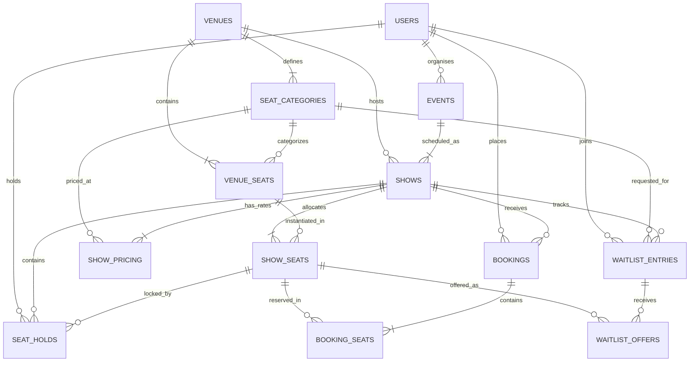

# Database Schema & Relational Modeling

This document details the relational database schema of the Ticket Booking System, including entity-relationship (ER) diagrams, table structures, constraints, indexes, and an analysis of structural double-booking prevention.

---

## Entity-Relationship (ER) Diagram

---

## Core Relational Tables

### 1. `users`
Stores user identities and role-based access levels.

| Column | Type | Constraints | Description |
| :--- | :--- | :--- | :--- |
| `id` | `INTEGER` | `PRIMARY KEY AUTOINCREMENT` | Unique user identifier |
| `email` | `VARCHAR(255)` | `UNIQUE, NOT NULL, INDEX` | User email for authentication & ticket delivery |
| `password_hash` | `VARCHAR(255)` | `NOT NULL` | Bcrypt password hash |
| `full_name` | `VARCHAR(255)` | `NOT NULL` | Display name and attendee identity |
| `role` | `VARCHAR(50)` | `NOT NULL, DEFAULT 'CUSTOMER'` | Role: `CUSTOMER`, `ORGANISER`, or `ADMIN` |
| `created_at` | `TIMESTAMP` | `NOT NULL, DEFAULT CURRENT_TIMESTAMP` | Account creation timestamp |

---

### 2. `venues`
Physical venues and auditoriums with grid dimensions.

| Column | Type | Constraints | Description |
| :--- | :--- | :--- | :--- |
| `id` | `INTEGER` | `PRIMARY KEY AUTOINCREMENT` | Unique venue identifier |
| `name` | `VARCHAR(255)` | `NOT NULL` | Venue name (e.g., Grand Cinema Hall) |
| `address` | `VARCHAR(255)` | `NOT NULL` | Street address |
| `city` | `VARCHAR(100)` | `NOT NULL` | City name |
| `total_rows` | `INTEGER` | `NOT NULL, DEFAULT 10` | Grid row dimension (A-Z) |
| `total_cols` | `INTEGER` | `NOT NULL, DEFAULT 12` | Grid column dimension (1-N) |
| `created_at` | `TIMESTAMP` | `NOT NULL` | Timestamp |

---

### 3. `seat_categories`
Tier levels and styling for venue seating.

| Column | Type | Constraints | Description |
| :--- | :--- | :--- | :--- |
| `id` | `INTEGER` | `PRIMARY KEY AUTOINCREMENT` | Unique category identifier |
| `venue_id` | `INTEGER` | `FK(venues.id ON DELETE CASCADE), NOT NULL` | Target venue |
| `name` | `VARCHAR(100)` | `NOT NULL` | Tier name (e.g. Standard, Premium, VIP) |
| `color_code` | `VARCHAR(50)` | `NOT NULL, DEFAULT '#3B82F6'` | Visual seat border/accent color |
| `tier_level` | `INTEGER` | `NOT NULL, DEFAULT 1` | Numeric tier level (1 = Standard, 2 = Premium, 3 = VIP) |

---

### 4. `venue_seats`
Static physical seats situated in a venue auditorium.

| Column | Type | Constraints | Description |
| :--- | :--- | :--- | :--- |
| `id` | `INTEGER` | `PRIMARY KEY AUTOINCREMENT` | Unique physical seat identifier |
| `venue_id` | `INTEGER` | `FK(venues.id ON DELETE CASCADE), NOT NULL` | Venue reference |
| `category_id` | `INTEGER` | `FK(seat_categories.id ON DELETE CASCADE), NOT NULL` | Assigned default category |
| `row_label` | `VARCHAR(10)` | `NOT NULL` | Row letter (e.g., 'A', 'B') |
| `seat_number` | `INTEGER` | `NOT NULL` | Seat number (e.g., 1, 2) |
| `grid_row` | `INTEGER` | `NOT NULL` | 0-indexed row position for 2D map |
| `grid_col` | `INTEGER` | `NOT NULL` | 0-indexed column position for 2D map |
| `is_active` | `BOOLEAN` | `NOT NULL, DEFAULT TRUE` | Active/accessible seat flag |

**Unique Constraint**: `UNIQUE(venue_id, row_label, seat_number)`

---

### 5. `events`
Parent movie or concert listings.

| Column | Type | Constraints | Description |
| :--- | :--- | :--- | :--- |
| `id` | `INTEGER` | `PRIMARY KEY AUTOINCREMENT` | Unique event identifier |
| `organiser_id` | `INTEGER` | `FK(users.id ON DELETE CASCADE), NOT NULL` | Organiser owner |
| `title` | `VARCHAR(255)` | `NOT NULL` | Event title |
| `description` | `TEXT` | `NULLABLE` | Event synopsis |
| `event_type` | `VARCHAR(50)` | `NOT NULL` | `MOVIE` or `CONCERT` |
| `banner_url` | `VARCHAR(500)` | `NULLABLE` | Poster/banner URL |
| `duration_minutes` | `INTEGER` | `NOT NULL, DEFAULT 120` | Duration in minutes |
| `created_at` | `TIMESTAMP` | `NOT NULL` | Creation timestamp |

---

### 6. `shows`
Scheduled showtimes binding an event to a venue at a specific date and time.

| Column | Type | Constraints | Description |
| :--- | :--- | :--- | :--- |
| `id` | `INTEGER` | `PRIMARY KEY AUTOINCREMENT` | Unique showtime identifier |
| `event_id` | `INTEGER` | `FK(events.id ON DELETE CASCADE), NOT NULL, INDEX` | Event reference |
| `venue_id` | `INTEGER` | `FK(venues.id ON DELETE CASCADE), NOT NULL, INDEX` | Venue reference |
| `start_time` | `TIMESTAMP` | `NOT NULL, INDEX` | Start timestamp |
| `end_time` | `TIMESTAMP` | `NOT NULL` | End timestamp |
| `status` | `VARCHAR(30)` | `NOT NULL, DEFAULT 'SCHEDULED'` | `SCHEDULED`, `CANCELLED`, `COMPLETED` |
| `created_at` | `TIMESTAMP` | `NOT NULL` | Timestamp |

---

### 7. `show_pricing`
Per-show pricing override for each category tier.

| Column | Type | Constraints | Description |
| :--- | :--- | :--- | :--- |
| `id` | `INTEGER` | `PRIMARY KEY AUTOINCREMENT` | Unique pricing identifier |
| `show_id` | `INTEGER` | `FK(shows.id ON DELETE CASCADE), NOT NULL, INDEX` | Target show |
| `category_id` | `INTEGER` | `FK(seat_categories.id ON DELETE CASCADE), NOT NULL, INDEX` | Target seat category |
| `price` | `FLOAT` | `NOT NULL` | Unit ticket price in USD |

**Unique Constraint**: `UNIQUE(show_id, category_id)`

---

### 8. `show_seats` (Per-Show Inventory)
Dynamic seat inventory for each specific showtime. Decouples physical geometry from dynamic availability.

| Column | Type | Constraints | Description |
| :--- | :--- | :--- | :--- |
| `id` | `INTEGER` | `PRIMARY KEY AUTOINCREMENT` | Unique show seat inventory identifier |
| `show_id` | `INTEGER` | `FK(shows.id ON DELETE CASCADE), NOT NULL, INDEX` | Show reference |
| `venue_seat_id` | `INTEGER` | `FK(venue_seats.id ON DELETE CASCADE), NOT NULL, INDEX` | Venue seat reference |
| `status` | `VARCHAR(30)` | `NOT NULL, DEFAULT 'AVAILABLE'` | `AVAILABLE`, `HELD`, `BOOKED`, `RESERVED_FOR_WAITLIST` |
| `version` | `INTEGER` | `NOT NULL, DEFAULT 1` | Optimistic locking version integer |

**Unique Constraint**: `UNIQUE(show_id, venue_seat_id)`

---

### 9. `seat_holds`
Temporary seat holds with strict Time-to-Live (TTL).

| Column | Type | Constraints | Description |
| :--- | :--- | :--- | :--- |
| `id` | `INTEGER` | `PRIMARY KEY AUTOINCREMENT` | Unique hold record identifier |
| `show_id` | `INTEGER` | `FK(shows.id ON DELETE CASCADE), NOT NULL, INDEX` | Target show |
| `show_seat_id` | `INTEGER` | `FK(show_seats.id ON DELETE CASCADE), NOT NULL, INDEX` | Target show seat |
| `user_id` | `INTEGER` | `FK(users.id ON DELETE CASCADE), NOT NULL, INDEX` | Holding user |
| `hold_token` | `VARCHAR(64)` | `NOT NULL, INDEX` | Unique UUID hold token for checkout |
| `created_at` | `TIMESTAMP` | `NOT NULL` | Hold creation timestamp |
| `expires_at` | `TIMESTAMP` | `NOT NULL, INDEX` | Hard expiration timestamp (e.g. now + 10m) |
| `status` | `VARCHAR(30)` | `NOT NULL, DEFAULT 'ACTIVE'` | `ACTIVE`, `EXPIRED`, `RELEASED`, `CONVERTED` |

---

### 10. `bookings`
Confirmed ticket bookings.

| Column | Type | Constraints | Description |
| :--- | :--- | :--- | :--- |
| `id` | `INTEGER` | `PRIMARY KEY AUTOINCREMENT` | Unique booking identifier |
| `booking_reference` | `VARCHAR(64)` | `UNIQUE, NOT NULL, INDEX` | Human-readable secure code (e.g. `TKT-2026-X8B9Q2`) |
| `user_id` | `INTEGER` | `FK(users.id ON DELETE CASCADE), NOT NULL, INDEX` | Booking customer |
| `show_id` | `INTEGER` | `FK(shows.id ON DELETE CASCADE), NOT NULL, INDEX` | Target show |
| `total_amount` | `FLOAT` | `NOT NULL` | Verified total amount paid |
| `status` | `VARCHAR(30)` | `NOT NULL, DEFAULT 'CONFIRMED'` | `CONFIRMED`, `CANCELLED` |
| `qr_code_data` | `TEXT` | `NULLABLE` | Base64 PNG data URI of server-generated QR code |
| `created_at` | `TIMESTAMP` | `NOT NULL` | Booking timestamp |
| `cancelled_at` | `TIMESTAMP` | `NULLABLE` | Cancellation timestamp |

---

### 11. `booking_seats`
Individual seat line-items associated with a confirmed booking.

| Column | Type | Constraints | Description |
| :--- | :--- | :--- | :--- |
| `id` | `INTEGER` | `PRIMARY KEY AUTOINCREMENT` | Unique booking seat identifier |
| `booking_id` | `INTEGER` | `FK(bookings.id ON DELETE CASCADE), NOT NULL, INDEX` | Parent booking |
| `show_seat_id` | `INTEGER` | `FK(show_seats.id ON DELETE CASCADE), NOT NULL, INDEX` | Show seat |
| `price_paid` | `FLOAT` | `NOT NULL` | Price recorded at time of transaction |

**Unique Constraint**: `UNIQUE(booking_id, show_seat_id)`

---

### 12. `waitlist_entries`
First-In-First-Out (FIFO) queue for sold-out shows per category tier.

| Column | Type | Constraints | Description |
| :--- | :--- | :--- | :--- |
| `id` | `INTEGER` | `PRIMARY KEY AUTOINCREMENT` | Unique waitlist entry identifier |
| `show_id` | `INTEGER` | `FK(shows.id ON DELETE CASCADE), NOT NULL, INDEX` | Target show |
| `category_id` | `INTEGER` | `FK(seat_categories.id ON DELETE CASCADE), NOT NULL, INDEX` | Target seat category |
| `user_id` | `INTEGER` | `FK(users.id ON DELETE CASCADE), NOT NULL, INDEX` | Customer |
| `status` | `VARCHAR(30)` | `NOT NULL, DEFAULT 'WAITING'` | `WAITING`, `OFFERED`, `FULFILLED`, `EXPIRED`, `CANCELLED` |
| `created_at` | `TIMESTAMP` | `NOT NULL, INDEX` | Timestamp determining FIFO priority |

---

### 13. `waitlist_offers`
Time-limited exclusive offers allocated to the top waitlisted customer upon booking cancellation.

| Column | Type | Constraints | Description |
| :--- | :--- | :--- | :--- |
| `id` | `INTEGER` | `PRIMARY KEY AUTOINCREMENT` | Unique offer identifier |
| `waitlist_entry_id` | `INTEGER` | `FK(waitlist_entries.id ON DELETE CASCADE), NOT NULL, INDEX` | Waitlist entry reference |
| `show_seat_id` | `INTEGER` | `FK(show_seats.id ON DELETE CASCADE), NOT NULL, INDEX` | Target released seat |
| `offer_token` | `VARCHAR(64)` | `UNIQUE, NOT NULL, INDEX` | Secure UUID token sent via email |
| `created_at` | `TIMESTAMP` | `NOT NULL` | Offer creation timestamp |
| `expires_at` | `TIMESTAMP` | `NOT NULL, INDEX` | Expiration timestamp (e.g. now + 10m) |
| `status` | `VARCHAR(30)` | `NOT NULL, DEFAULT 'PENDING'` | `PENDING`, `ACCEPTED`, `EXPIRED`, `DECLINED` |

---

## Why Double-Booking Is Structurally Impossible

1. **Explicit Row-Level Locking (`SELECT ... FOR UPDATE`)**:
   During hold placement, checkout completion, and waitlist claims, the database transaction locks the target `show_seats` records before inspecting or mutating their `status`. Any concurrent transaction attempting to read or write the same seat is blocked until the active transaction commits or rolls back.
2. **Atomic State Transition Verification**:
   Inside the locked transaction, the backend validates that `show_seats.status == 'AVAILABLE'` (for holds) or `show_seats.status == 'HELD'` with valid unexpired token ownership (for bookings). If any seat fails this check, the transaction aborts and rolls back immediately.
3. **Database-Level Unique Constraints**:
   - `show_seats(show_id, venue_seat_id)` guarantees one physical seat can only have one inventory record per show.
   - `booking_seats(booking_id, show_seat_id)` prevents the same show seat from appearing multiple times in the same booking.
   - `waitlist_offers(offer_token)` and `seat_holds(hold_token)` enforce unique cryptographic session tokens.
