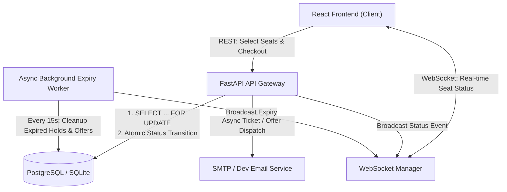
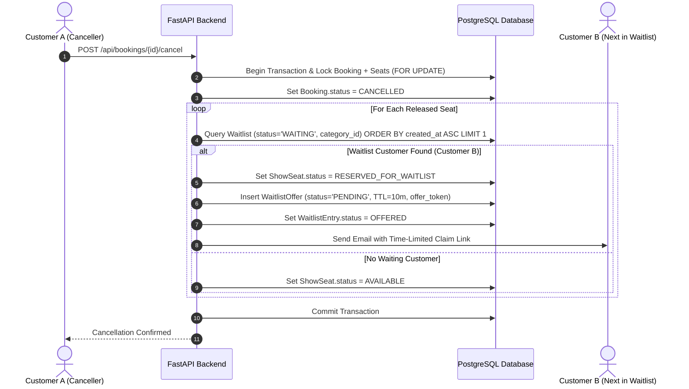

# System Design: Seat Hold TTL, Concurrency, and Waitlist Reallocation

## Overview & Architecture

The Ticket Booking System delivers deterministic concurrency control, automated seat-hold lifecycle management with Time-to-Live (TTL), and automated First-In-First-Out (FIFO) waitlist reallocation upon booking cancellations.

---

## 1. Concurrency Protection & Transaction Flow

Simultaneous attempts to hold or book the same seat are resolved at the database transaction level, ensuring zero double-booking.

### Step-by-Step Hold Transaction Execution
1. **Request Intake**: The customer sends `POST /api/holds` with `show_id` and an array of `show_seat_ids`.
2. **Transaction Start**: The backend begins an isolated database transaction.
3. **Lazy Cleanup**: The backend executes a targeted cleanup for any expired holds on the requested seats.
4. **Row-Level Lock Acquisition**: The backend issues `SELECT ... FROM show_seats WHERE id IN (...) FOR UPDATE`. The database engine places exclusive row-level locks on the target seats. Any competing concurrent request targeting these seats is paused by the database engine until this transaction completes.
5. **State Validation**: Inside the exclusive lock, the backend verifies that every requested seat has `status == 'AVAILABLE'`.
6. **Conflict Handling (Losing Request)**: If any seat is already `HELD`, `BOOKED`, or `RESERVED_FOR_WAITLIST`, the transaction issues a rollback and returns a clean `HTTP 409 Conflict` with the exact seat row and number (e.g. "Seat A3 is no longer available").
7. **State Mutation & Hold Token (Winning Request)**: If all seats are available, the backend updates `show_seats.status = 'HELD'`, generates a cryptographic UUID `hold_token`, and inserts records into `seat_holds` with `expires_at = now() + HOLD_TTL_SECONDS` (10 minutes).
8. **Transaction Commit**: The transaction commits atomically.
9. **Real-time Broadcast**: The WebSocket manager broadcasts a `SEATS_HELD` event to all connected clients viewing that show.

---

## 2. Seat Hold TTL & Dual Expiry Mechanism

To protect inventory from abandonment without relying on volatile in-memory timers, the system implements dual expiration enforcement:

1. **Lazy Expiry on Access**: Every seat map query (`GET /api/shows/{id}/seats`) and hold attempt triggers an atomic check:
   $$\text{SeatHold.status} = \text{'ACTIVE'} \land \text{SeatHold.expires_at} \le \text{now()}$$
   Matching seats are immediately reset to `AVAILABLE` within the reading transaction.
2. **Periodic Background Worker**: An asynchronous background loop runs every 15 seconds, scanning for expired active holds, batch-reverting `show_seats.status` to `AVAILABLE`, and pushing WebSocket updates to client browsers.

---

## 3. Booking Completion & Server-Side Verification

1. The customer submits `POST /api/bookings` with their `hold_token`.
2. The transaction takes an exclusive `FOR UPDATE` lock on `seat_holds` and `show_seats`.
3. The backend validates:
   - Hold belongs to the authenticated user (`hold.user_id == current_user.id`).
   - Hold status is `ACTIVE`.
   - $\text{now()} < \text{hold.expires\_at}$ (server time as single source of truth).
4. **Price Verification**: Total amount is recalculated strictly from `show_pricing` records in the database, ignoring client-supplied numbers.
5. `show_seats.status` transitions to `BOOKED` and `seat_holds.status` transitions to `CONVERTED`.
6. A secure `booking_reference` and server-side QR code are generated. The transaction commits, and a confirmation email is dispatched.

---

## 4. Cancellation & Waitlist Auto-Assignment Flow

When an event is sold out, customers join category-specific waitlists (`waitlist_entries`), which are ordered strictly First-In-First-Out (FIFO) by `created_at`.

### Time-Limited Offer Expiry
- If Customer B claims the offer within 10 minutes, the offer transitions to `ACCEPTED`, the entry to `FULFILLED`, and the seat to `BOOKED`.
- If the offer expires, the background worker marks the offer `EXPIRED` and automatically invokes the allocation pipeline for the next customer in the FIFO queue. If the queue is exhausted, the seat reverts to `AVAILABLE`.
